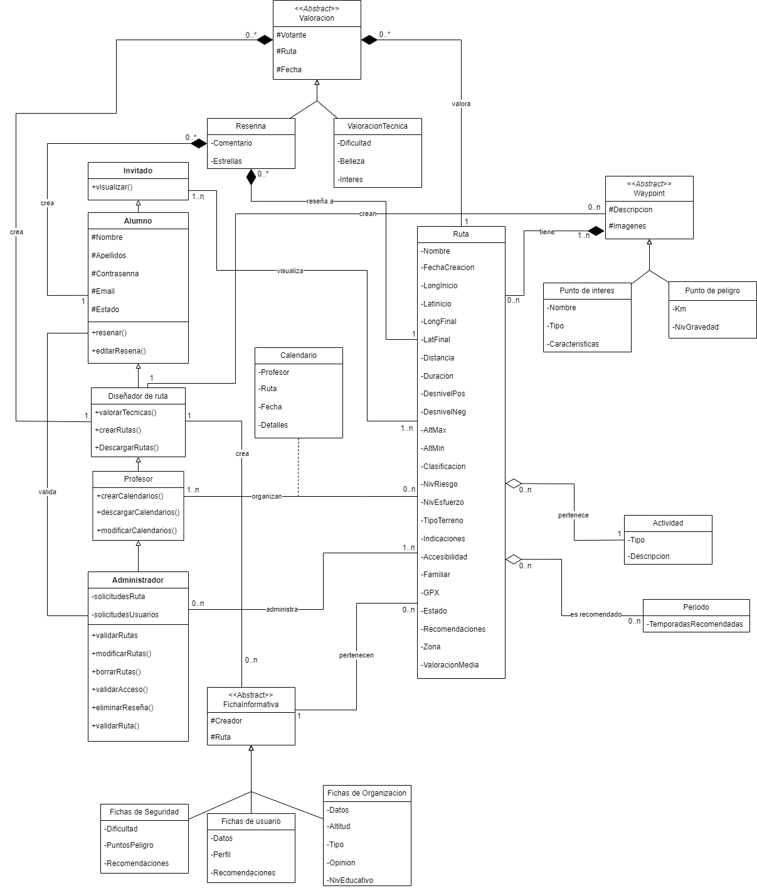
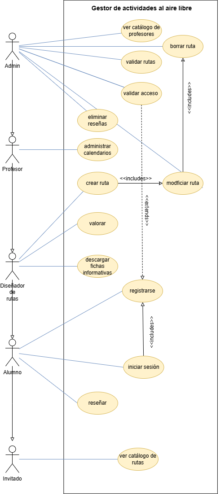

# Documentacion y entregas del equipo **RDosM2**

## Miembros

- Miguel Ángel Quian Díaz
- Maya García Velasco
- Daniel Cabeza Berrazueta
- Raúl Buenaga García

## Indice de entregas
<!--Para enlazar correctamente, crear un header con #/##/### y vincular -> [texto](#nombreDelHeader)-->
1. [Diagrama de clases](#diagrama-clases)
2. [Diagrama de casos de uso](#diagrama-de-casos-de-uso)
3. [Manual de despliegue](#manual-despliegue)
4. [Manual de usuario](#manual-de-usuario)
5. [Informes de la aplicación de escritorio](#informes-de-la-aplicación)
6. [Base de datos y Script](#base-de-datos)
7. [Script de disparadores](#script-disparadores)
8. [Página web y hoja de estilos](#página-web-y-estilos)
9. [Plantilla XSLT](#xslt)
10. [Infografía de Seguridad Social](#infografía-sobre-seguridad-social)
11. [Identificación de factores de riesgos](#factores-de-riesgo)
12. [Matriz de riesgo](#matriz-de-riesgo)
13. [Plan de emergencias](#plan-de-emergencias)
14. [Tarea I.T](#tarea-it)

   
   

## Diagrama clases
[Diagrama de clases completo](https://educantabria.sharepoint.com/:b:/r/sites/RETODAM1DAM12025-39009471-DAM1-EQUIPO1/Documentos%20compartidos/DAM1-EQUIPO1/ARCHIVOS%20RETO/Diagrama%20de%20clases%20espero%20que%20sea%20el%20ultimo.pdf?csf=1&web=1&e=UkPkpz)

[Diagrama de clases que hemos aplicado](https://educantabria.sharepoint.com/:b:/r/sites/RETODAM1DAM12025-39009471-DAM1-EQUIPO1/Documentos%20compartidos/DAM1-EQUIPO1/ARCHIVOS%20RETO/Diagrama%20de%20clases%20aplicado.pdf?csf=1&web=1&e=eYL99k)

## Diagrama de casos de uso
[Diagrama](https://educantabria.sharepoint.com/:i:/r/sites/RETODAM1DAM12025-39009471-DAM1-EQUIPO1/Documentos%20compartidos/DAM1-EQUIPO1/ARCHIVOS%20RETO/casos_uso.drawio.png?csf=1&web=1&e=hHwa4F)

[Descripción](https://educantabria.sharepoint.com/:w:/r/sites/RETODAM1DAM12025-39009471-DAM1-EQUIPO1/Documentos%20compartidos/DAM1-EQUIPO1/ARCHIVOS%20RETO/descripci%C3%B3n%20de%20casos%20de%20uso.docx?d=w5e06507a021a45c7ab6b5103337c9e46&csf=1&web=1&e=00XqIP)

## Manual despliegue

[Manual de despliegue](https://educantabria.sharepoint.com/:b:/r/sites/RETODAM1DAM12025-39009471-DAM1-EQUIPO1/Documentos%20compartidos/DAM1-EQUIPO1/ARCHIVOS%20RETO/MANUAL%20DESPLIEGUE%20(1).pdf?csf=1&web=1&e=AdxFBu)

## Manual de usuario
[Plantilla](https://educantabria.sharepoint.com/:w:/r/sites/RETODAM1DAM12025-39009471-DAM1-EQUIPO1/Documentos%20compartidos/DAM1-EQUIPO1/ARCHIVOS%20RETO/MANUAL%20USUARIO.docx?d=w06038e8d45524639a670f50dc6b88509&csf=1&web=1&e=OlXqLQ)

## Informes de la aplicación

## Base de datos

[Script](https://educantabria.sharepoint.com/:u:/r/sites/RETODAM1DAM12025-39009471-DAM1-EQUIPO1/Documentos%20compartidos/DAM1-EQUIPO1/ARCHIVOS%20RETO/BD/GeneracionBD_Equipo1.sql?csf=1&web=1&e=hKzkjL)

[Relacional](https://educantabria.sharepoint.com/:u:/r/sites/RETODAM1DAM12025-39009471-DAM1-EQUIPO1/Documentos%20compartidos/DAM1-EQUIPO1/ARCHIVOS%20RETO/BD/EER_EQUIPO1_V10.mwb?csf=1&web=1&e=e1JlMH)

[Relacional formato PDF](https://educantabria.sharepoint.com/:b:/r/sites/RETODAM1DAM12025-39009471-DAM1-EQUIPO1/Documentos%20compartidos/DAM1-EQUIPO1/ARCHIVOS%20RETO/BD/EER_EQUIPO1_V10.pdf?csf=1&web=1&e=KapWHP)

<!--Para enlazar imagenes, añade una ! a un enlace normal-->

[Script ejemplos](https://educantabria.sharepoint.com/:u:/r/sites/RETODAM1DAM12025-39009471-DAM1-EQUIPO1/Documentos%20compartidos/DAM1-EQUIPO1/ARCHIVOS%20RETO/BD/DatosEjemploBD_Equipo1.sql?csf=1&web=1&e=DBjGqU)

## Script disparadores
[Script de TRIGGERS](https://educantabria.sharepoint.com/:u:/r/sites/RETODAM1DAM12025-39009471-DAM1-EQUIPO1/Documentos%20compartidos/DAM1-EQUIPO1/ARCHIVOS%20RETO/BD/Script%20disparadores-Equipo1.sql?csf=1&web=1&e=PxRWOw)
## Página web y estilos

## XSLT
[Transformacion .gpx -> CSV](https://educantabria.sharepoint.com/:u:/r/sites/RETODAM1DAM12025-39009471-DAM1-EQUIPO1/Documentos%20compartidos/DAM1-EQUIPO1/ARCHIVOS%20RETO/gpxToCSV?csf=1&web=1&e=XLbvS2)
## Infografía sobre Seguridad Social
[Infografia de SS en PDF](https://educantabria.sharepoint.com/:b:/r/sites/RETODAM1DAM12025-39009471-DAM1-EQUIPO1/Documentos%20compartidos/DAM1-EQUIPO1/ARCHIVOS%20RETO/Infografia%20SS.pdf?csf=1&web=1&e=En4MY3)

## Factores de riesgo
[Factores de Riesgo PDF](https://educantabria.sharepoint.com/:b:/r/sites/RETODAM1DAM12025-39009471-DAM1-EQUIPO1/Documentos%20compartidos/DAM1-EQUIPO1/ARCHIVOS%20RETO/IDENTIFICACION_DE_RIESGOS_EQUIPO1.pdf?csf=1&web=1&e=Mhk5Ep)
## Matriz de riesgo
[Matriz de Riesgo en PDF](https://educantabria.sharepoint.com/:b:/r/sites/RETODAM1DAM12025-39009471-DAM1-EQUIPO1/Documentos%20compartidos/DAM1-EQUIPO1/ARCHIVOS%20RETO/Matriz%20de%20riesgo.pdf?csf=1&web=1&e=s3ks61)

## Plan de emergencias
[Plan de emergencias en PDF](https://educantabria.sharepoint.com/:b:/r/sites/RETODAM1DAM12025-39009471-DAM1-EQUIPO1/Documentos%20compartidos/DAM1-EQUIPO1/ARCHIVOS%20RETO/Plan%20de%20emergencias.pdf?csf=1&web=1&e=8r9907)

## Tarea IT
[Tarea](https://educantabria.sharepoint.com/:b:/r/sites/RETODAM1DAM12025-39009471-DAM1-EQUIPO1/Documentos%20compartidos/DAM1-EQUIPO1/ARCHIVOS%20RETO/Tarea_IT_Equipo1.pdf?csf=1&web=1&e=qgO1M3)

